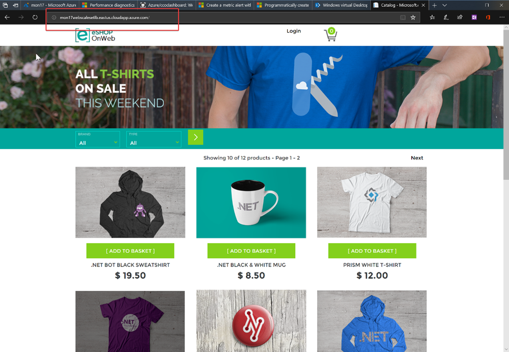

# Challenge 00 - Prerequisites - Ready, Set, GO!

**[Home](../README.md)** - [Next Challenge >](./Challenge-01.md)

## Introduction

You have been contracted to deploy, monitor and manage an online shopping website in Azure for a start-up company called "eShopOnWeb".  After evaluating the requirements, you develop a solution in Azure that includes an Azure environment that consists of (2) Azure resource groups that include a VNet, subnets, NSG(s), LB(s), NAT rules, scale set and a fully functional .NET Core Application (eShopOnWeb) to monitor.

Upon successful testing, you present your solution to company's leadership for approval along with the PowerShell, CLI and/or Azure Cloud Shell options for quick deployment. 

They were very excited about how quickly you are able to deploy the solution, and give you the green light to proceed.

## Prerequisites

Thank you for participating in the Datadog On Azure What The Hack. 

You will need an Azure Subscription with sufficient RBAC roles assigned to complete the challenges at the subscription scope.

You can complete this entire hack in a web browser using the Azure Portal, Datadog Portal, and Azure Cloud Shell.

However, if you work with Azure and on a regular basis, these are tools you should consider having installed on your local workstation:

- [Azure Subscription](../../000-HowToHack/WTH-Common-Prerequisites.md#azure-subscription)
- [Windows Subsystem for Linux](../../000-HowToHack/WTH-Common-Prerequisites.md#windows-subsystem-for-linux)
- [Managing Cloud Resources](../../000-HowToHack/WTH-Common-Prerequisites.md#managing-cloud-resources)
  - [Azure Portal](../../000-HowToHack/WTH-Common-Prerequisites.md#azure-portal)
  - [Azure CLI](../../000-HowToHack/WTH-Common-Prerequisites.md#azure-cli)
    - [Note for Windows Users](../../000-HowToHack/WTH-Common-Prerequisites.md#note-for-windows-users)
    - [Azure PowerShell CmdLets](../../000-HowToHack/WTH-Common-Prerequisites.md#azure-powershell-cmdlets)
  - [Azure Cloud Shell](../../000-HowToHack/WTH-Common-Prerequisites.md#azure-cloud-shell)
- [Visual Studio Code](../../000-HowToHack/WTH-Common-Prerequisites.md#visual-studio-code)
  - [VS Code plugin for ARM Templates](../../000-HowToHack/WTH-Common-Prerequisites.md#visual-studio-code-plugins-for-arm-templates)
  - [VS Code plugin for Bicep](https://marketplace.visualstudio.com/items?itemName=ms-azuretools.vscode-bicep)

## Description

For this challenge, you will deploy the pre-developed scripts using either PowerShell or Azure CLI. This script will setup the environment with a specific focus learning Azure monitor.  Should you require additional knowledge outside of Azure monitor for this hack, please refer to [Azure Learning](https://docs.microsoft.com/en-us/learn/).

### Deploy Resources

Use either the [Azure CLI](https://docs.microsoft.com/en-us/cli/azure/?msclkid=6b97242fb99411ec83659823c955fa16) or the [PowerShell Az module](https://docs.microsoft.com/en-us/powershell/azure/install-az-ps) to deploy the baseline requirements to start the Monitoring WTH

#### Azure CLI

1. Copy the code below and paste it in your desired tool: PowerShell, Terminal, VSCode, or CloudShell.

    ```az login --tenant "<Tenant ID>"```

2. Replace `<Tenant ID>` with your Azure Tenant ID. This can be found on the Overview blade of Azure AD in the Azure Portal.

3. Press the ENTER key and login to Azure using the prompt.

4. Copy the code below and paste it in your desired tool:

    ```az account set --subscription "<Subscription ID>"```

5. Replace `<Subscription ID>` with your Azure Subscription ID. This can be round on the Overview blade of your Subscription in the Azure Portal.

6. Press the ENTER key to set your default Azure subscription.

7. Copy the Azure CLI code below:

    ```
    az deployment sub create --name "<Username>" --location "eastus" -f challenge-00_Template.bicep --verbose
    ```

8. Paste the code in your desired tool.

9. Replace `<Username>` with your username, not your UPN (e.g., username, **NOT** username@outlook.com).

10. You will be prompted to enter values for the local admin Username and Password for the Azure virtual machines and scale set instances.  Enter a username and password that adheres to [Azure VM Username Requirements](https://docs.microsoft.com/en-us/azure/virtual-machines/windows/faq#what-are-the-username-requirements-when-creating-a-vm-) and [Azure VM Password Requirements](https://docs.microsoft.com/en-us/azure/virtual-machines/windows/faq#what-are-the-password-requirements-when-creating-a-vm-)

#### PowerShell with the AZ Module

1. Copy the PowerShell code below and paste it in your desired tool: PowerShell, Terminal, VSCode, or CloudShell.

    ```Connect-AzAccount -Tenant '<Tenant ID>' -Environment 'AzureCloud' -Subscription '<Subscription ID>'```

2. Replace `<Tenant ID>` with your Azure Tenant ID.  This can be found on the Overview blade of Azure AD in the Azure Portal.  

3. Replace `<Subscription ID>` with your Azure Subscription ID.  This can be round on the Overview blade of your Subscription in the Azure Portal.

4. Press the ENTER key and login to Azure using the prompt.

5. Copy the PowerShell code below:

    ```
    New-AzDeployment -Name "<Username>" -Location "eastus" -TemplateUri "https://raw.githubusercontent.com/jamasten/WhatTheHack/master/007-AzureMonitoring/Student/Resources/challenge-00_Template.json" -Verbose
    ```

6. Paste the code in your desired tool.

7. Replace `<Username>` with your username, not your UPN (e.g. username, **NOT** username@outlook.com).

8. Press ENTER to start the deployment.

9. You will be prompted to enter values for the local admin Username and Password for the Azure virtual machines and scale set instances.  Enter a username and password that adheres to Azure's requirements. [Azure VM Username Requirements](https://docs.microsoft.com/en-us/azure/virtual-machines/windows/faq#what-are-the-username-requirements-when-creating-a-vm-) and [Azure VM Password Requirements](https://docs.microsoft.com/en-us/azure/virtual-machines/windows/faq#what-are-the-password-requirements-when-creating-a-vm-)

### View Deployed Resources

- Once the deployment has completed, navigate to the Public IP Address resource, **pip-wth-monitor-web-d-eu** , in the Azure Portal.  
- In the Overview blade, copy the DNS name to your clipboard.  
- Open a web browser, paste your DNS name in the address bar and press ENTER.  Your browser should render the eShopOnWeb site. 



## Success Criteria

- Verify you can see the website deployed
- Verify the resources contained in architecture diagram below are present in your own Azure subscription.


## Learning Resources

- [Get Started with Azure PowerShell](https://docs.microsoft.com/en-us/powershell/azure/get-started-azureps?view=azps-6.4.0)
- [Get Started with Azure Command-Line Interface (CLI)](https://docs.microsoft.com/en-us/cli/azure/get-started-with-azure-cli)
- [Overview of Azure Cloud Shell](https://docs.microsoft.com/en-us/azure/cloud-shell/overview)

## Tips

- Make sure the Admin password adheres to the Azure password policy
- Make sure you are logged into the correct subscription and you have the at least contributors role access.  
- Make sure you have the compute capacity in the region you are deploying to and request an increase to the limit if needed.
- Make sure you are using a region that supports the public preview for Azure Monitor for VMs